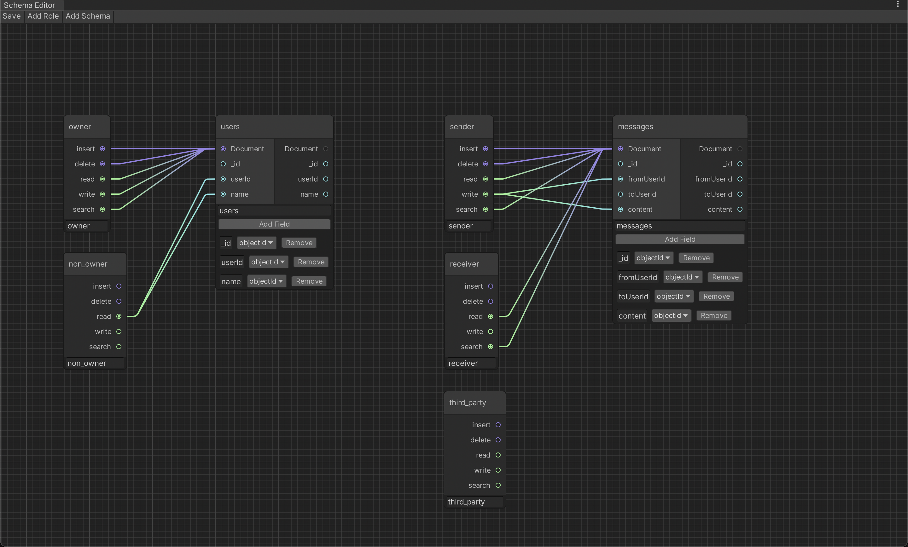

# realm-schema-editor
A node editor for MongoDB Realm's rules and schemas, based on Unity's GraphView system.

## Disclaimer
This editor is code for a Unity project, and therefore requires a prior installation of Unity and
configuration of a Unity project. The code does not directly edit your MongoDB Realm rules and schemas.
This project is solely intended to help you visualize your schemas and rules, allowing you to:
 * create roles with insert, delete, read, write, and search permissions
 * create schemas with fields that contain a name and BSON type
 * connect fields from one schema to another
 * give certain roles permissions to certain schemas

## Use
"Open" or double-click /Assets/RealmSchema/Data.asset in the Unity Editor
to open a node editor for the data. Click "Save" when you want to save.
"Add Role" will add a role node. "Add Schema" will add a schema node.

## Example Configuration
The configuration shows five roles: owner, non_owner, sender, receiver, third_party.

Owners have full document-wide permissions for documents in the users collection.
Non_owners only have read permissions for certain fields of documents in the users collection.

Senders have full document-wide permissions, except writing, for documents in the messages collection.
Senders can only write the fromUserId and content fields
(or the _id and toUserId fields on insert, but this behaviour is too complicated for the editor)
Receivers have document-wide read permissions for documents in the messages collection.
Third_parties have no permissions for documents in the messages collection.

Each document in the users collection has:
 * an objectId _id field (the document's internal id)
 * a string userId field (the user's id)
 * a string name field (the user's name)

Each document in the messages collection has:
 * an objectId _id field (the document's internal id)
 * a string fromUserId field (the sender's id)
 * a string toUserId field (the receiver's id)
 * a string content field (the message's content)

